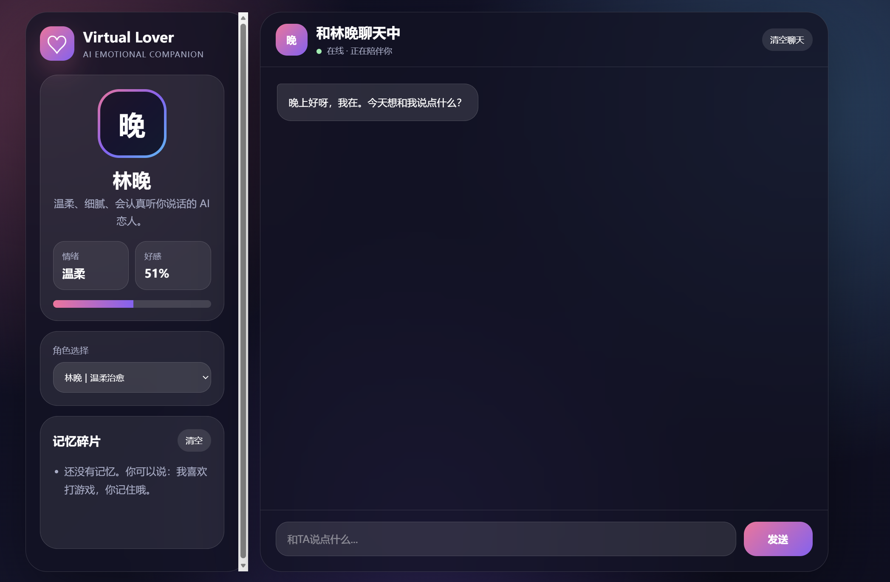

# 💖 Virtual AI Lover

一个基于 HTML / CSS / JavaScript 开发的虚拟 AI 恋人 Web 应用。  
项目模拟 AI 情感陪伴产品，支持角色聊天、情绪状态、好感度、长期记忆等功能。

---

## ✨ 项目预览

### 聊天界面


---

## 🚀 项目功能

- 💬 AI 虚拟恋人聊天
- 🧠 长期记忆系统
- ❤️ 好感度系统
- 😊 情绪状态系统
- 🎭 多角色切换
- 💾 本地聊天记录保存
- 🌌 科技感 UI 界面
- 📱 响应式布局（支持移动端）

---

## 🛠 技术栈

- HTML5
- CSS3
- JavaScript
- LocalStorage

---

## 📂 项目结构

```bash
.
├── index.html
├── style.css
├── script.js
├── README.md
└── preview.png
 
---

````md
---

## ⚡ 如何运行

直接双击：

```bash
index.html
````

即可运行项目。

---

## 🌐 GitHub Pages 部署

1. 新建 GitHub 仓库
2. 上传项目文件
3. 进入：

```txt
Settings → Pages
```

4. Source 选择：

```txt
main branch
```

5. 保存后等待生成网址

---

## 🧠 项目亮点

本项目重点模拟：

* AI 情感陪伴
* AI 人设系统
* 情绪交互
* 长期记忆
* 虚拟角色体验

相比传统 CRUD 学生项目，更偏向 AI 应用方向。

---

## 📌 后续升级方向

* [ ] 接入 DeepSeek API
* [ ] 接入 OpenAI API
* [ ] 增加真实 AI 对话
* [ ] 增加 Live2D
* [ ] 增加语音聊天
* [ ] 增加登录系统
* [ ] 增加云端数据库
* [ ] 打包桌面 App

---

## 📄 简历项目描述

独立开发虚拟 AI 恋人 Web 应用，
基于 HTML、CSS、JavaScript 实现聊天交互、人设系统、好感度系统、情绪状态与长期记忆功能，
支持本地聊天记录持久化与响应式布局，可部署至 GitHub Pages 展示。

---

## ⭐ 项目目标

希望通过这个项目探索：

* AI 陪伴产品设计
* AI 应用开发
* 前端交互体验
* 情感化 UI 设计

```
```
